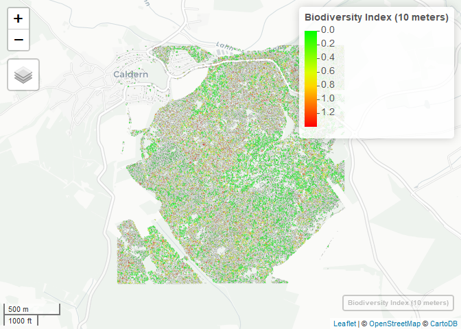

Overview of the Biodiversity Index at a 10 meters environment
-------------------------------------------------------------

This is a preview of the map for tree species biodiversity in a 30 meter
environment for the University Forest Caldern. Unfortunatley, due to
file size limitations on github, the fully interactive version of the
[map](http://seminar.environmentalinformatics-marburg.de/Seminar_RS/biodiversity10.html)
is hosted by servers of the Environmental Informatics Department of the
University of Marburg. Be aware that the file size is above 100 MB.

The index is based on a 10 meter environment for every tree and then
[calculating](https://github.com/goergen95/mof_caldern/blob/master/src/011_structure_values.R#L173)
the Shannon-Weaver Entropy index for the different species present in
the neighbourhood. At this scale, it gives a good overview of
biodiversity hotspots in the forest area.

