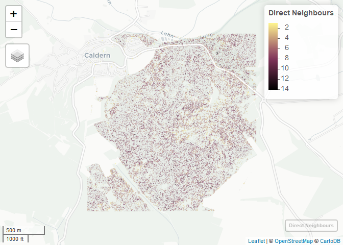

Number of direct neighbours for each individual tree
----------------------------------------------------------

This is a preview of the map of the number of direct neighbours for the University Forest Caldern. Unfortunatley, due to
file size limitations on github, the fully interactive version of the
[map](http://seminar.environmentalinformatics-marburg.de/Seminar_RS/drcN.html)
is hosted by servers of the Environmental Informatics Department of the
University of Marburg. Be aware that the file size is above 100 MB.

This index was calculated by a ten centimeter buffer and counting the
intersecting polygons in the neihborhood of each segment. The code to
calculate the [direct
neigbours](https://github.com/goergen95/mof_caldern/blob/master/src/011_structure_values.R#L142)
can be seen here. It thus indicates some measure of competition. By
clicking on ploygons you will get addtional information including:

