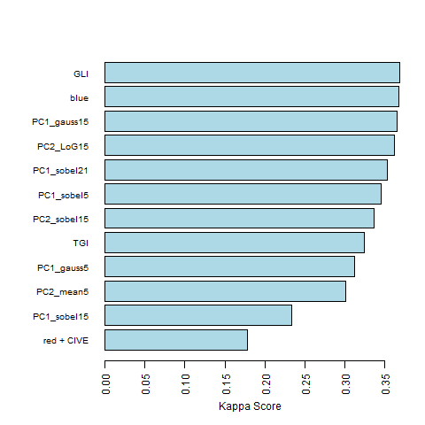

## Exploration of the Random Forest Classifier

For the prediction of tree species a Random Forest Classifier was used.
Random Forest is a widely used machine learning algorithm based on simple decision tree models.
At each node of a tree the data is split on the basis of variables in the predictor dataset. While Random Forest can also be used for regression problems, it actually performs better on classifications. In the final node of each individual tree a classification is given. The majority of all trees grown in the forest then decides the final class of a given observation.

The model was trained on a forward-feature selection based on variables obtained from an RGB image of the University Forest in Caldern.
Following predictors proved best to model tree species:

| Predictor                                       | Kappa gain |
| ----------------------------------------------- | ---------- |
| Red Band                                        |            |
| Color Index of Vegetation (CIVE)                | 0.178      |
| First PCA Sobel Filter 15 window                | 0.055      |
| Second PCA Mean Filter 5 window                 | 0.067      |
| First PCA Gauss Filter 5 window                 | 0.011      |
| Triangulated Greenness Index (TGI)              | 0.013      |
| Second PCA Sobel Filter 15 window               | 0.011      |
| First PCA Mean Filter 5 window                  | 0.009      |
| First PCA Sobel Filter 21 window                | 0.009      |
| Second PCA Laplace of Gaussian Filter 15 window | 0.008      |
| First PCA Gauss Filter 15 window                | 0.004      |
| Blue Band                                       | 0.002      |
| Green Leaf Index (GLI)                          | 0.003      |

The code for calculating different [vegetation indices](https://github.com/goergen95/mof_caldern/blob/master/src/000_fun.R#L163) can be found here. In order to reduce the dimensionality of the predictor dataset, we decided to implement a [principal component analysis](https://github.com/goergen95/mof_caldern/blob/master/src/003_pcAnalysis.R). The first two principal components combined together explain above 80% of the variance of all the vegetation indices. This way, we could apply [spatial filters](https://github.com/goergen95/mof_caldern/blob/master/src/000_fun.R#L63) solely to the prinicpal components and therefore dramatically reduce the computation time of the forward-feature selection.

The [forward feature selection](https://github.com/goergen95/mof_caldern/blob/master/src/010_rf_classification.R) chose 13 variables to model the tree species. Kappa score was chosen as the evaluation metric and the final internal Kappa was **0.37**. According to common interpretation of the Kappa score, this only yields in a **fair** level of agreement.

| Score       | Level of Agreement |
| ----------- | ------------------ |
| <0          | Less than chance   |
| 0 - 0.20    | Slightly           |
| 0.21 - 0.40 | Fair               |
| 0.41 - 0.60 | Moderate           |
| 0.61 - 0.80 | Substantial        |
| 0.81 - 0.99 | Almost Perfect     |

The final variables chosen for classification and their contribution to the increase in the Kappa score are displayed below.

This relatively low Kappa score might result from an inadequate sampling strategy. Here, 400 trees, 100 for each species, were polygonised in QGIS and attributed to a class based on visual interpretation of the RGB image as well as an additional shape file indicating forest sections and the dominating species within these sections. The pixels were extracted based on the ID of the individual polygons and a training sample of 8,000 pixels with 20 pixels from each tree were extracted. The remaining dataset was used to calculate an independent Kappa value which achieves with **0.26** also a fair level of agreement.

The low level of agreement results in the confusion of the different species classes. The largest component of the error results from oak pixels being classified as beech pixels. Also a large proportion of pixels from the class Douglas Spruce are wrongly classified as beech. Because the amount of the error is quite high, structurally overestimating the beech class while underestimating the other, the model needs some improvement for an accurate classification of tree species. A different sampling design could prove beneficial while it is unlikely that a higher level of agreement could be achieved with more or different predictors based on RGB images. In contrast, structural predictors generated through the use of LiDAR data could possibly also yield to higher Kappa scores.

Class Specific Accuracy values are as follows:

| Class       | Sensitivity | Specifity | Positive Prediction Rate | Negative Prediction Rate | Balanced Accuracy |
| ----------- | ----------- | --------- | ------------------------ | ------------------------ | ----------------- |
| Beech       | 0.68        | 0.57      | 0.45                     | 0.78                     | 0.63              |
| Dgl. Spruce | 0.28        | 0.94      | 0.53                     | 0.83                     | 0.61              |
| Oak         | 0.45        | 0.77      | 0.44                     | 0.78                     | 0.61              |
| Spruce      | 0.35        | 0.97      | 0.72                     | 0.88                     | 0.66              |

