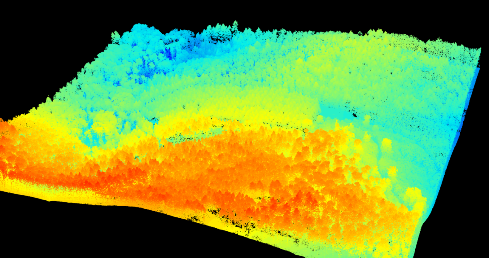
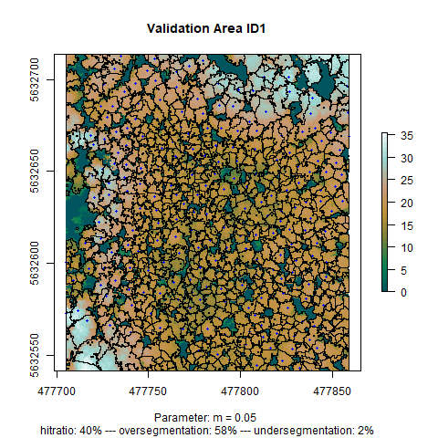
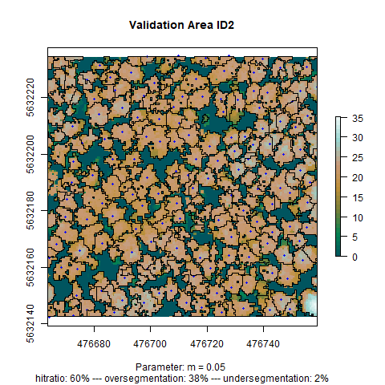

## Processing LIDAR data with ForestTools

The tree segmentation was based on LIDAR data. LIDAR data is obtained by laser rays sent to the earth's surface by air vehicles. By measuring the time difference between sending a beam and receiving its reflection, information about the distance and the height of objects on the earth's surface can be obtained. In forests, we can observe significant differences in the height of returns from crowns and the ground. These differences can be used to apply an image segmentation to define single trees. In the raw format, LiDAR data consists of a point-cloud which looks like this:

The code to preprocess the LiDAR data can be found [here](https://github.com/goergen95/mof_caldern/blob/master/src/004_lidar_preprocess.R). In order to segment individual trees from the point cloud we decided to use the algorithm implemented in the ForestTools package. This algorithm works on a Canopy Height Model (CHM) in raster format which we derived from the LiDAR data. Each cell takes the value of the height above 0 for a given resolution which here was chosen with 0.5 x 0.5 meters. We chose that resolution because statistically there are only 4 returns per square meter on average. ForestTool's algorithm grows a watershed around the highest pixel in a given environment. That means in the first step, possible tree positions need to be found with a search grid for each pixel. Here, for defining the size of the search grid, we implemented a simple linear equation which depends on the height of a given pixel in the form of: \(WinSize = m*height+b\) We set **b** to a steady value of 1.2 because we achieved stable results with that parametrization and the linear shift along the y-axis does not yield significant different results. To find a good parameter for **m**, though, we implemented a sampling strategy for three different structured areas in the forest. We set points for each tree by visual interpretation of the CHM. Then, we optimized the parameter **m** for each sample area individually and compared the settings to each other, choosing the one yielding fair results in all sample areas. The code for the segmentation process can be found [here](https://github.com/goergen95/mof_caldern/blob/master/src/007_tree_seg_validation.R).

