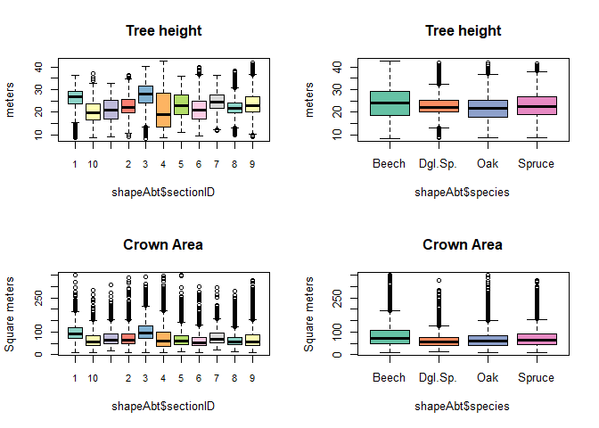
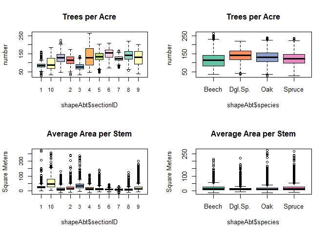
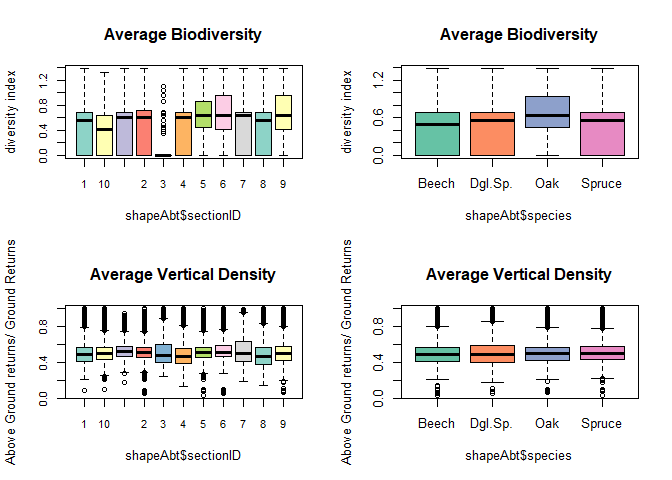

Statistical Results
-------------------------------------------------------------

In this section we present the distribution of some of the indicators we
retrieved from combining our species classification with the tree
segmentation. The results are presented according to species and forest
sections. On the map below, the sections of interest are coloured by the
dominant species. Note, that for the ease of displaying the results some
of the sections were combined together based on spatial distances.

    <iframe class="map-iframe" src="../assets/maps/mapobjects/statmap.html" width="600" height="450" frameborder="0"
    ></iframe>

The first two parameters are quite straight forward. These are the tree
height, indicated by the highest pixel value within each segment and the
total crown area. We present the results as boxplots for each of the
species and for all sections of the forest. Note, that only trees which
within the sections are included. In total, they consitute **21,209**
trees.

As we can see, there is not much of a difference between species when
all the individuals are considered together. But if we consider the
individuals within specific sections of the forest, differences become
more evident.

The next two parameters try to grasp this difference a little more. The
first one, the [number of
trees](https://github.com/GeoMOER-Students-Space/mpg-envinfosys-teams-2018-rs_18_axmideda/blob/master/src/011_structure_values.R#L122)
within a one-acre buffer is an indicator for the density of the
vegetation a tree encounters in its environment. The other one, the
[average free space per
stem](https://github.com/GeoMOER-Students-Space/mpg-envinfosys-teams-2018-rs_18_axmideda/blob/master/src/011_structure_values.R#L139),
takes the one-acre buffer, substracts the total crown area and divides
the remaining amount of free space by the number of trees within the
buffer. It is thus an indicator for how much space is available for an
individual tree on average.

The last two parameters give some information about the
[biodiversity](https://github.com/GeoMOER-Students-Space/mpg-envinfosys-teams-2018-rs_18_axmideda/blob/master/src/011_structure_values.R#L173)
and [structural vertical
density](https://github.com/GeoMOER-Students-Space/mpg-envinfosys-teams-2018-rs_18_axmideda/blob/master/src/011_structure_values.R#L97)
of the areas surrounding trees. Biodiversity is measured by calculating
the entropy of species occuring in a 10 meter environment of each tree.
The vertical density of the vegetation is measured by the percentage of
above-ground LiDAR returns (h&gt;2m) per 2m².

